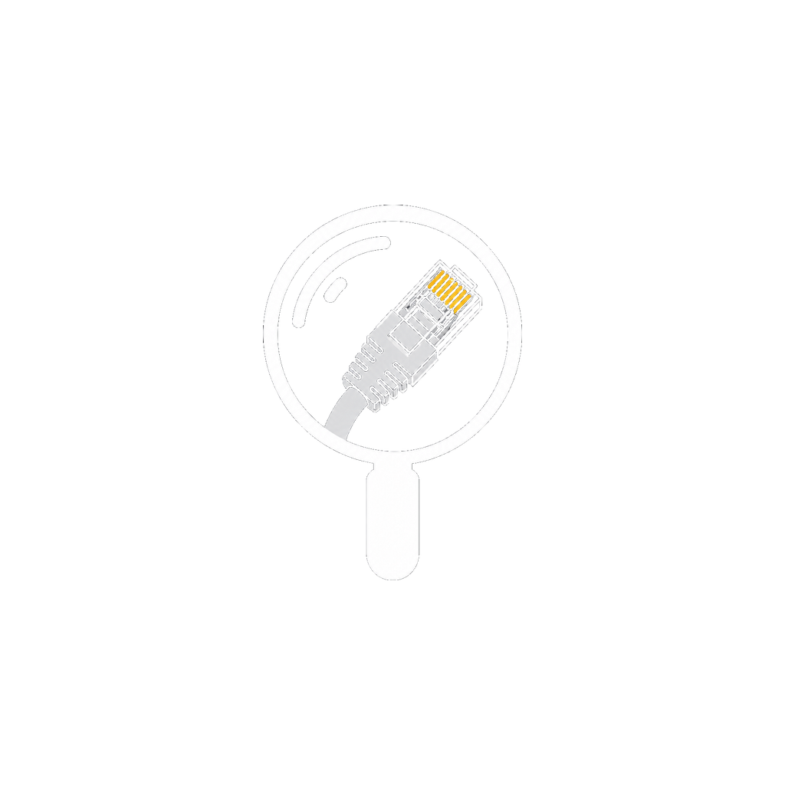
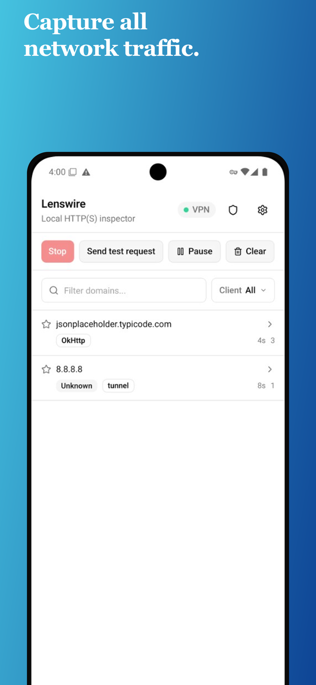
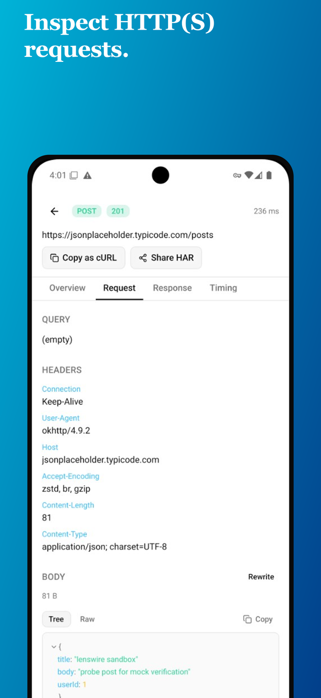

<div align="center">
  
  <h1>Lenswire</h1>
  <p>
    <strong>Local HTTP(S) inspector</strong> · <strong>iOS Packet Tunnel</strong> · <strong>Android VpnService</strong> · <strong>MIT</strong>
  </p>
  <p>
    <a href="https://dmitryshelomanov.github.io/lenswire/"><strong>Website</strong></a>
    ·
    <a href="https://dmitryshelomanov.github.io/lenswire/privacy/">Privacy</a>
  </p>
</div>

<br />

<table>
<tr>
<td width="50%" valign="top" align="center">

</td>
<td width="50%" valign="top" align="center">

</td>
</tr>
</table>

<p>Lenswire is a native HTTP(S) inspector with a local MITM proxy. Decrypt HTTPS when Lenswire CA is installed and <code>HTTPS decryption</code> is enabled.</p>
<ul>
<li>🔐 HTTPS decryption with Lenswire CA (Generate CA → Install CA + toggle)</li>
<li>📱 Device VPN + local MITM: iOS (Packet Tunnel) and Android (VpnService)</li>
<li>🧭 Domain groups, client tags, and filters (method / status / path)</li>
<li>🧪 Override rules: request rewrite + response mocks</li>
<li>📋 Copy as cURL, Share HAR, fail-open bypass with clear reasons</li>
<li>🧰 <code>sandbox/</code> probe app + <code>sim:trust-ca</code> / <code>android:trust-ca</code> scripts</li>
</ul>

<br />

> Primary focus: decrypt and inspect real device traffic via iOS Packet Tunnel / Android VpnService.

### Links

- **Website:** [dmitryshelomanov.github.io/lenswire](https://dmitryshelomanov.github.io/lenswire/)
- [Repository](https://github.com/dmitryshelomanov/lenswire)
- [Issues](https://github.com/dmitryshelomanov/lenswire/issues)
- [Expo SDK 57 docs](https://docs.expo.dev/versions/v57.0.0/)
- Privacy policy: [`docs/privacy.md`](docs/privacy.md) · [live page](https://dmitryshelomanov.github.io/lenswire/privacy/)
- [Store assets map](docs/STORE-ASSETS.md) — what to upload where, regenerate commands
- EAS project: https://expo.dev/accounts/dshelomanovs-team/projects/lenswire

### Android / Google Play

- [Play Console setup](docs/play-store/PLAY-CONSOLE.md) — AAB upload, keystore, `eas submit`
- [Store listing copy](docs/play-store/LISTING.md) — name, short/full description, asset paths
- [Data safety answers](docs/play-store/DATA-SAFETY.md) — Play Console forms & permissions
- Listing assets: [`docs/play-store/`](docs/play-store/) · phone screenshots: [`docs/store-screenshots/android/framed-*.png`](docs/store-screenshots/android/)
- iPhone App Store screenshots (ready): [`docs/store-screenshots/*.png`](docs/store-screenshots/)

```bash
npm run build:android:preview:local   # APK for sideload (preferred)
npm run build:android:local           # AAB for Play upload (preferred)
npm run build:android:preview         # cloud APK (slower)
npm run build:android                 # cloud AAB (slower)
npm run screenshots:store             # marketing frames 1290×2796
npm run screenshots:play              # Play graphic + Android framed screenshots
```

## Store release checklist

| Item                                  | Android / Play                                                                                  | iOS / App Store                                      |
| ------------------------------------- | ----------------------------------------------------------------------------------------------- | ---------------------------------------------------- |
| App id / package in config            | Done (`com.lenswire.app`)                                                                       | Done (`com.lenswire.app` + Packet Tunnel extension)  |
| Icon + splash in binary               | Done                                                                                            | Done                                                 |
| Privacy policy URL                    | Done ([live](https://dmitryshelomanov.github.io/lenswire/privacy/))                             | Done (same URL; paste in ASC)                        |
| Phone listing screenshots             | Done ([`framed-*.png`](docs/store-screenshots/android/) via `screenshots:play`)                 | Done ([`01–06.png`](docs/store-screenshots/))        |
| Feature graphic / listing icon        | Done ([`play-store/`](docs/play-store/) via `screenshots:play`)                                 | n/a (uses app icon)                                  |
| Listing copy + compliance docs        | Done ([`LISTING`](docs/play-store/LISTING.md), [`DATA-SAFETY`](docs/play-store/DATA-SAFETY.md)) | Todo (`docs/app-store/` not started)                 |
| EAS production profile / scripts      | Done (`build:android:local`, upload keystore on EAS)                                            | Todo (no `build:ios` / `submit:ios` yet)             |
| Store-signed production binary        | Done (AAB via local EAS → `dist/android/lenswire-production-1.0.0.aab`)                         | Todo (`.ipa` via EAS)                                |
| Real Apple Team ID in `app.json`      | n/a                                                                                             | Todo (`appleTeamId` is still `YOUR_APPLE_TEAM_ID`)   |
| Network Extension entitlements        | n/a                                                                                             | Todo (paid Apple Developer + NE capability approved) |
| Developer account + store console app | Todo (Play Console create + first AAB upload)                                                   | Todo (Apple Developer + App Store Connect)           |
| Automated submit credentials          | Todo (Google service account for `eas submit`)                                                  | Todo (App Store Connect API key)                     |
| Internal test track                   | Todo (Play Internal testing)                                                                    | Todo (TestFlight)                                    |
| Tablet screenshots                    | Optional                                                                                        | Todo if `supportsTablet` stays true                  |
| Public production release             | Todo                                                                                            | Todo                                                 |

Full asset map: [`docs/STORE-ASSETS.md`](docs/STORE-ASSETS.md). Android upload steps: [`docs/play-store/PLAY-CONSOLE.md`](docs/play-store/PLAY-CONSOLE.md).

## Requirements

- Node **22.13+** (see [`.nvmrc`](.nvmrc))
- Mac + Xcode 16+ (iOS)
- Android Studio / SDK (Android)
- For **iOS device VPN**: Apple Developer Program (Network Extension) + physical iPhone
- For **iOS Simulator**: free Personal Team is enough (tunnel capture still needs a device)
- For **Android**: no paid account required (`VpnService`)

## Run

Shared setup once:

```bash
nvm use
npm install
```

### iOS

**First time / after native changes** (`targets/network-packet-tunnel/`, `vendor/`, entitlements, NE):

```bash
npm run prebuild:ios   # expo prebuild --clean + link-hev-ios (HevSocks5Tunnel)
```

**Day-to-day:**

```bash
npm run ios                              # Simulator (UI only — no Packet Tunnel)
npx expo run:ios --device                # physical iPhone (full TUN → hev → SOCKS → MITM)
```

| | Simulator | Device |
|--|--|--|
| App UI | yes | yes |
| Full capture (VPN) | **no** (`IPC failed`) | yes (paid team + NE + `appleTeamId`) |

On device after install: **Certificate** → Generate/Install/Trust CA → **Start** → allow VPN → Safari. Details: [`modules/lenswire-proxy/ios/README.md`](modules/lenswire-proxy/ios/README.md).

If you ran plain `expo prebuild` without the npm script, link hev manually: `npm run link:hev-ios`.

### Android

**First time / after native changes** (`modules/lenswire-proxy/android/`, manifest, Gradle):

```bash
npm run prebuild:android
```

**Day-to-day:**

```bash
npm run android          # emulator or device (full TUN → tun2socks → SOCKS → MITM)
```

After install: **Certificate** → Generate CA → on rooted AVD for Chrome use `npm run android:trust-ca` → **Start** → allow VPN. Details: [`modules/lenswire-proxy/android/README.md`](modules/lenswire-proxy/android/README.md).

## iOS: Install CA → view HTTPS

1. **Certificate** → Generate CA
2. Install profile (device) **or** `npm run sim:trust-ca` (Simulator)
3. Settings → General → About → Certificate Trust Settings → enable Lenswire CA
4. **Start** → allow VPN (device)
5. Open Safari / apps without pinning — decrypted requests appear with headers and bodies

Toggle **HTTPS decryption** in Settings. Apps with certificate pinning will fail while decryption is on.

## iOS Simulator

Packet Tunnel does **not** work on Simulator (`IPC failed`). Full capture requires a physical device (see **Run → iOS** above).

Optional Mac HTTP proxy for Simulator Safari: `npm run sim:mac-proxy-on` / `sim:mac-proxy-off`, plus `npm run sim:trust-ca` after Generate CA.

## Android full-device mode

```bash
npm run android
# Certificate → Generate CA
# Emulator (required for Chrome decrypt): npm run android:trust-ca
# Start → allow VPN → open https://example.com
```

### Sandbox app (User CA + mock probes)

[`sandbox/`](sandbox/) is a separate Expo RN app (`com.lenswire.sandbox`) that trusts **User CAs** via `networkSecurityConfig`. Use it to check decrypt without System CA (after Install CA), and later to verify mocks.

```bash
# Lenswire: Generate CA → Install CA → HTTPS decrypt ON
cd sandbox && npm install && npm run prebuild:android && npm run build:apk
adb install -r android/app/build/outputs/apk/release/app-release.apk
# Stop/Start VPN if you previously saw trust?/bypassed CONNECT tunnels, then GET post
```

See [`sandbox/README.md`](sandbox/README.md). If you only see `CONNECT` + `trust?`/`bypassed`, Stop VPN (clears bypass), Install CA again after Generate.

### Android emulator: System CA (required for Chrome)

On Android 7+, Chrome and most apps **ignore User CAs**. `Install CA` alone puts the cert under **Trusted credentials → User**, which causes browser warnings like “certificate is not trusted by your device's operating system” and pages fail to load while HTTPS decryption is ON.

Use a rooted AVD (**system image without Google Play**):

1. Certificate → **Generate CA**
2. From the project root:

```bash
npm run android:trust-ca
```

On **Android 14+** this overlays the Conscrypt APEX trust store (not only `/system/etc/security/cacerts`). Manual “Install CA” (User store) is **not** enough for Chrome. Settings → Trusted credentials may not list the CA even when trust works — rely on decrypt succeeding.

3. Force-stop Chrome (script does this), then: Lenswire → HTTPS decryption **Enabled** → Start → open `https://example.com` or `https://m.vk.ru`

Expect decrypted `GET`/`POST` rows (not only `CONNECT`). Google/pinned apps may stay tunnel-only.

**Temporary workaround** without System CA: Settings → HTTPS decryption **OFF** → Stop/Start (sites load again; no decrypt).

If `Install CA` does not open anything, install manually as User CA (not enough for Chrome):

- `Settings` → `Security` → `Encryption & credentials` → `Install a certificate` → `CA certificate`.

To export the generated Android CA file manually:

```bash
# Verify cert files inside app sandbox
adb shell run-as com.lenswire.app ls files/certs

# Export DER cert to current host directory
adb exec-out run-as com.lenswire.app cat files/certs/lenswire-ca.cer > lenswire-ca.cer

# Optional: copy to device Downloads
adb push lenswire-ca.cer /sdcard/Download/lenswire-ca.cer
```

The generated files in app sandbox are:

- `files/certs/lenswire-ca.cer` (DER, recommended for install)
- `files/certs/lenswire-ca.pem` (PEM)

Notes:

- Android routes device traffic through TUN (`VpnService`) → `tun2socks` → SOCKS bridge → local MITM proxy.
- iOS (device) uses the same model: Packet Tunnel `utun` → hev → SOCKS → MITM (no system HTTP proxy). Details: [`modules/lenswire-proxy/ios/README.md`](modules/lenswire-proxy/ios/README.md).
- HTTP capture works without emulator/browser manual proxy setup.
- HTTPS Path B (TCP/443): SNI-aware MITM (SOCKS peeks ClientHello, proxy uses hostname for leaf cert).
- Fail-open: recoverable MITM failures fall back to passthrough; handshake-rejected hosts are bypassed for the session.
- QUIC / HTTP/3 is not decrypted (`quicDecrypt: false`); browsers typically fall back to TCP HTTPS. SOCKS UDP ASSOCIATE is used for DNS, not for QUIC decrypt.
- Tunnel-only rows show a reason (`no sni`, `trust?`, `tls off`, …) in the traffic list and request Overview.
- Pinned apps remain tunnel-only even with System CA. Lenswire cannot bypass pinning — on a rooted device unpin separately (Frida / objection / LSPosed), then decrypt again.
- Trust vs pinning: System CA fixes Chrome/browser trust; Frida-style unpinning is a separate step for apps that pin certificates.
- No Apple Developer account needed for Android (`VpnService`). iOS full capture needs a paid team + Network Extension + physical device.
- After regenerating the iOS native project, use `npm run prebuild:ios` (runs `link:hev-ios`) so HevSocks5Tunnel is linked into the Packet Tunnel target.

## Device usage (real iOS VPN)

1. Paid Apple Developer team + physical iPhone
2. **Certificate** → Generate CA → Install profile → trust in Settings
3. **Start** → allow VPN
4. Open Safari or any app — decrypted HTTPS appears in the list

## Architecture

VPN layer (Packet Tunnel on iOS / VpnService on Android) intercepts device traffic and forwards it to a local MITM (`LocalProxyServer`). HTTPS decryption works only when Lenswire CA is installed and `HTTPS decryption` is enabled.

```
iOS device:  apps → PacketTunnel(utun) → hev → SOCKS → LocalProxyServer (MITM) → UI
iOS Sim:     Packet Tunnel unavailable — use device for full capture
Android:     VpnService(TUN) → tun2socks → SOCKS bridge → LocalProxyServer(MITM) → UI
```

Key components:

- `targets/network-packet-tunnel/`: iOS Packet Tunnel (VPN interception + hev + SOCKS)
- `modules/lenswire-proxy/`: native bridge wiring the tunnel/proxy to the app
- `LocalProxyServer`: local MITM proxy (HTTPS decryption + request data to UI)
- [`modules/lenswire-proxy/android/README.md`](modules/lenswire-proxy/android/README.md): Android capture stack (TUN → SOCKS → MITM)
- [`modules/lenswire-proxy/ios/README.md`](modules/lenswire-proxy/ios/README.md): iOS capture stack (utun → hev → SOCKS → MITM)
- `sandbox/`: separate RN probe app (checks User CA trust + mocks)
- `app/`: UI and settings (CA trust / `HTTPS decryption`)

## Scripts

| Script                                      | Purpose                                             |
| ------------------------------------------- | --------------------------------------------------- |
| `npm run ios` / `android`                   | Build & run                                         |
| `npm run prebuild:ios` / `prebuild:android` | Regenerate native projects (iOS also runs `link:hev-ios`) |
| `npm run link:hev-ios`                      | Link HevSocks5Tunnel into Packet Tunnel (after prebuild) |
| `npm run build:android:preview:local`       | Local EAS preview APK                               |
| `npm run build:android:local`               | Local EAS production AAB                            |
| `npm run screenshots:store`                 | Colorful marketing frames + website JPG screenshots |
| `npm run screenshots:play`                  | Play feature graphic + Android framed screenshots   |
| `npm run website:dev` / `website:deploy`    | Landing page (GitHub Pages)                         |
| `npm run sim:trust-ca`                      | Trust app-generated CA in booted iOS Simulator      |
| `npm run android:trust-ca`                  | Install Lenswire CA into System store (rooted AVD)  |
| `npm run sim:mac-proxy-on/off`              | Mac HTTP(S) proxy helpers                           |

## About

Built by **[Dmitry Shelomanov](https://dmitryshelomanov.github.io/)** — Senior Frontend / React Native developer.

## Socials

- [Personal site](https://dmitryshelomanov.github.io/)
- [Telegram](https://t.me/dmitryshelomanov)
- [GitHub](https://github.com/dmitryshelomanov)
