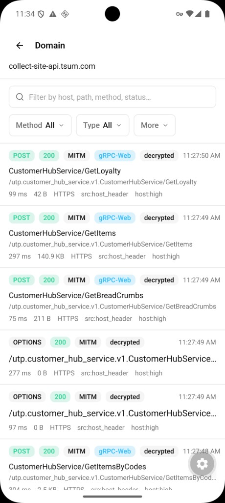
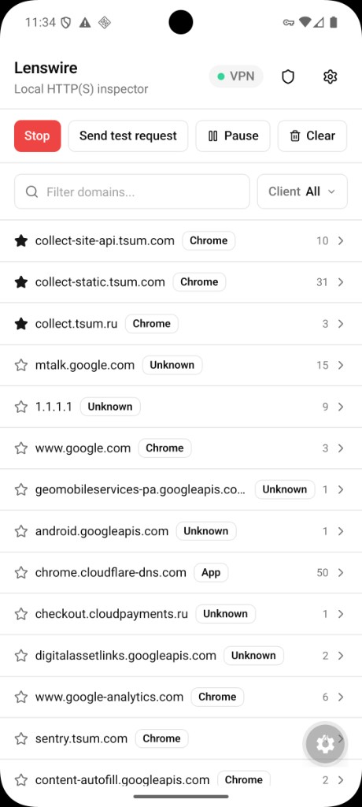

<div align="center">
  
  <h1>Lenswire</h1>
  <p>
    <strong>Native MITM inspector</strong> · <strong>iOS Packet Tunnel</strong> · <strong>Android VpnService</strong>
  </p>
</div>

<br />

<div>
<p>Lenswire is a native HTTP(S) inspector with a local MITM proxy. It can decrypt HTTPS traffic when Lenswire CA is installed and <code>HTTPS decryption</code> is enabled.</p>
<ul>
<li>HTTPS decryption with Lenswire CA (Generate CA → Install CA + <code>HTTPS decryption</code> toggle)</li>
<li>Device VPN + local MITM: iOS (Packet Tunnel) and Android (VpnService → tun2socks → SOCKS bridge)</li>
<li>iOS Simulator dev mode: in-process <code>LocalProxyServer</code> (fast iteration)</li>
<li>Traffic filters: method/scheme/status/resource type/query + “overridden only” view</li>
<li>Override rules: request rewrite + response mocks (status, content-type, headers, body)</li>
<li>Headers editing includes Cookie (any header can be changed; empty value removes it)</li>
<li>Fail-open MITM + session bypass with clear reasons (“trust?”, “bypassed”, tunnel-only)</li>
<li>Decrypted request visibility (headers + bodies) and HAR export for captures</li>
<li><code>sandbox/</code> app: validate User CA trust and run deterministic HTTPS probes</li>
<li>Scripted trust workflow: <code>sim:trust-ca</code> + <code>android:trust-ca</code></li>
</ul>
<div style="display:flex; gap:12px; justify-content:center; align-items:flex-start; margin-top:14px; flex-wrap:wrap;">
  
  
</div>
</div>

<br />

> Primary focus: decrypt and inspect real device traffic via iOS Packet Tunnel / Android VpnService.

## Requirements

- Node **22.13+** (see [`.nvmrc`](.nvmrc))
- Mac + Xcode 16+ (iOS)
- Android Studio / SDK (Android)
- For **iOS device VPN**: Apple Developer Program (Network Extension) + physical iPhone
- For **iOS Simulator Dev Mode**: free Personal Team is enough
- For **Android**: no paid account required (`VpnService`)

## Run

```bash
nvm use
npm install
npm run prebuild:ios       # first time / after native iOS changes
npm run ios                # Simulator OK without paid NE team

npm run prebuild:android   # first time / after native Android changes
npm run android
```

## iOS: Install CA → view HTTPS

1. **Certificate** → Generate CA
2. Install profile (device) **or** `npm run sim:trust-ca` (Simulator)
3. Settings → General → About → Certificate Trust Settings → enable Lenswire CA
4. **Start** → allow VPN (device)
5. Open Safari / apps without pinning — decrypted requests appear with headers and bodies

Toggle **HTTPS decryption** in Settings. Apps with certificate pinning will fail while decryption is on (same as Proxyman).

## iOS Simulator Dev Mode

Packet Tunnel does **not** work on Simulator (`IPC failed`). Dev Mode starts `LocalProxyServer` in-process.

```bash
npm run ios
# Certificate → Generate CA
npm run sim:trust-ca
# Start → Send test request (HTTP) or Mac proxy + Safari HTTPS
```

Optional Mac HTTP proxy for Simulator Safari: `sim:mac-proxy-on` / `sim:mac-proxy-off`.

## Android full-device mode

```bash
npm run android
# Certificate → Generate CA
# Emulator (required for Chrome decrypt): npm run android:trust-ca
# Start → allow VPN → open https://example.com
```

### Sandbox app (User CA + mock probes)

[`sandbox/`](sandbox/) is a separate Expo RN app (`com.lenswire.sandbox`) that trusts **User CAs** via `networkSecurityConfig`. Use it to check decrypt without System CA (after Install CA), and later to verify mocks.

```bash
# Lenswire: Generate CA → Install CA → HTTPS decrypt ON
cd sandbox && npm install && npm run prebuild:android && npm run build:apk
adb install -r android/app/build/outputs/apk/release/app-release.apk
# Stop/Start VPN if you previously saw trust?/bypassed CONNECT tunnels, then GET post
```

See [`sandbox/README.md`](sandbox/README.md). If you only see `CONNECT` + `trust?`/`bypassed`, Stop VPN (clears bypass), Install CA again after Generate.

### Android emulator: System CA (required for Chrome)

On Android 7+, Chrome and most apps **ignore User CAs**. `Install CA` alone puts the cert under **Trusted credentials → User**, which causes browser warnings like “certificate is not trusted by your device's operating system” and pages fail to load while HTTPS decryption is ON.

Use a rooted AVD (**system image without Google Play**):

1. Certificate → **Generate CA**
2. From the project root:

```bash
npm run android:trust-ca
```

3. After reboot: Settings → Security → Trusted credentials → **System** → confirm **Lenswire CA**
4. Lenswire → HTTPS decryption **Enabled** → Start → open `https://example.com` or `https://m.vk.ru`

Expect decrypted `GET`/`POST` rows (not only `CONNECT`). Google/pinned apps may stay tunnel-only.

**Temporary workaround** without System CA: Settings → HTTPS decryption **OFF** → Stop/Start (sites load again; no decrypt).

If `Install CA` does not open anything, install manually as User CA (not enough for Chrome):

- `Settings` → `Security` → `Encryption & credentials` → `Install a certificate` → `CA certificate`.

To export the generated Android CA file manually:

```bash
# Verify cert files inside app sandbox
adb shell run-as com.lenswire.app ls files/certs

# Export DER cert to current host directory
adb exec-out run-as com.lenswire.app cat files/certs/lenswire-ca.cer > lenswire-ca.cer

# Optional: copy to device Downloads
adb push lenswire-ca.cer /sdcard/Download/lenswire-ca.cer
```

The generated files in app sandbox are:

- `files/certs/lenswire-ca.cer` (DER, recommended for install)
- `files/certs/lenswire-ca.pem` (PEM)

Notes:

- Android routes device traffic through TUN (`VpnService`) → `tun2socks` → SOCKS bridge → local MITM proxy.
- HTTP capture works without emulator/browser manual proxy setup.
- HTTPS Path B (TCP/443): SNI-aware MITM (SOCKS peeks ClientHello, proxy uses hostname for leaf cert).
- Fail-open: recoverable MITM failures fall back to passthrough; handshake-rejected hosts are bypassed for the session.
- SOCKS bridge is **TCP-only** — UDP/443 (QUIC) is not decrypted; Chrome typically falls back to TCP HTTPS.
- Tunnel-only rows show a reason (`no sni`, `trust?`, `tls off`, …) in the traffic list and request Overview.
- Pinned apps remain tunnel-only even with System CA. Lenswire cannot bypass pinning — on a rooted device unpin separately (Frida / objection / LSPosed), then decrypt again.
- Trust vs pinning: System CA fixes Chrome/browser trust; Frida-style unpinning is a separate step for apps that pin certificates.
- No Apple Developer account needed — Android `VpnService` is sufficient for this workflow.

## Device usage (real iOS VPN)

1. Paid Apple Developer team + physical iPhone
2. **Certificate** → Generate CA → Install profile → trust in Settings
3. **Start** → allow VPN
4. Open Safari or any app — decrypted HTTPS appears in the list

## Architecture

VPN layer (Packet Tunnel on iOS / VpnService on Android) intercepts device traffic and forwards it to a local MITM (`LocalProxyServer`). HTTPS decryption works only when Lenswire CA is installed and `HTTPS decryption` is enabled.

```
iOS device:  apps → Packet Tunnel → LocalProxyServer (MITM) → UI
iOS Sim:     Start → in-process LocalProxyServer → UI
Android:     VpnService(TUN) → tun2socks → SOCKS bridge → LocalProxyServer(MITM) → UI
```

Key components:

- `targets/network-packet-tunnel/`: iOS Packet Tunnel (VPN interception)
- `modules/lenswire-proxy/`: native bridge wiring the tunnel/proxy to the app
- `LocalProxyServer`: local MITM proxy (HTTPS decryption + request data to UI)
- `sandbox/`: separate RN probe app (checks User CA trust + mocks)
- `app/`: UI and settings (CA trust / `HTTPS decryption`)

## Scripts

| Script                                      | Purpose                                            |
| ------------------------------------------- | -------------------------------------------------- |
| `npm run ios` / `android`                   | Build & run                                        |
| `npm run prebuild:ios` / `prebuild:android` | Regenerate native projects                         |
| `npm run sim:trust-ca`                      | Trust app-generated CA in booted iOS Simulator     |
| `npm run android:trust-ca`                  | Install Lenswire CA into System store (rooted AVD) |
| `npm run sim:mac-proxy-on/off`              | Mac HTTP(S) proxy helpers                          |

## About

Built by **[Dmitry Shelomanov](https://dmitryshelomanov.github.io/)** — Senior Frontend / React Native developer.

## Socials

- [Personal site](https://dmitryshelomanov.github.io/)
- [Telegram](https://t.me/dmitryshelomanov)
- [GitHub](https://github.com/dmitryshelomanov)
